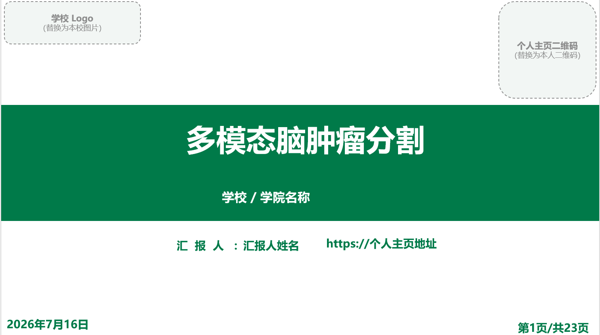
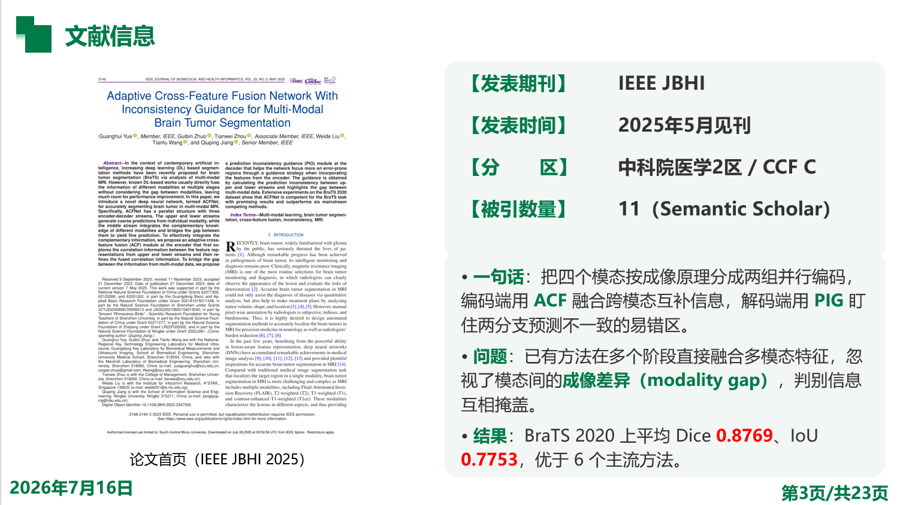
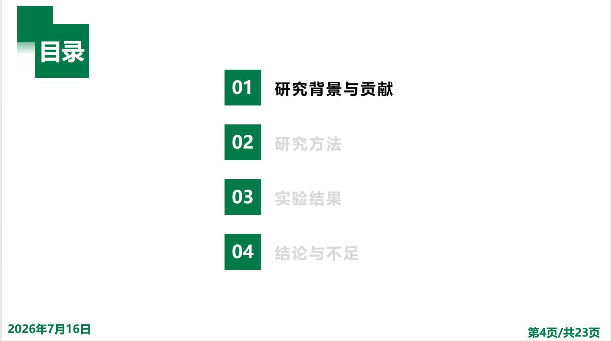
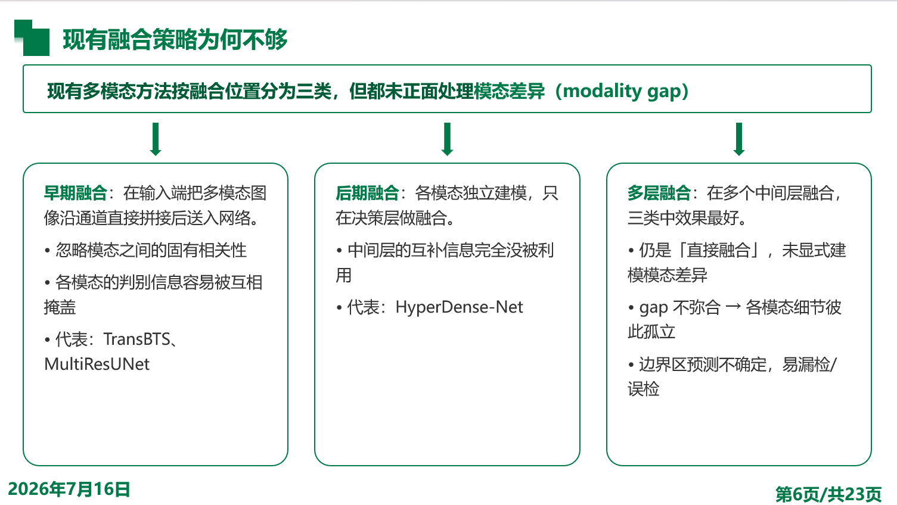
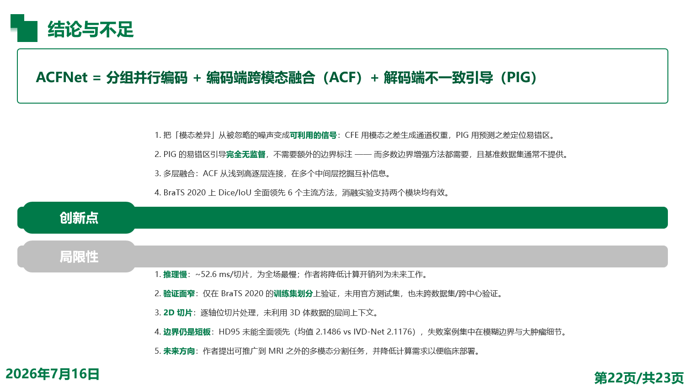

# cs-group-meeting-skill

<p align="center"><i>中文版本：<b><a href="README.md">README.md</a></b> ｜ English (current)</i></p>

Turns a CS paper PDF into a Chinese group-meeting (组会) slide deck — matching the
look of the lab's `汇报模板.pptx` and the layout vocabulary of `汇报模板2.pptx`.

What you get is **a six-part argument, not a pile of pictures**:
文献信息 (Paper info) → 研究背景 (Background) → 本文贡献 (Contributions) →
研究方法 (Method) → 实验结果 (Results) → 结论与不足 (Conclusion & limitations).
Every figure slide must carry both a bullet box and a results-analysis box — a slide
that is just one image with a one-line caption will make the build fail on purpose.

The everyday way to use it is not to type commands, but to hand the paper to the agent:

> 把这篇论文做成组会 PPT  *(“Turn this paper into a group-meeting deck”)*

The agent reads the whole paper, extracts figures, writes the spec, builds the deck,
and renders each page to check it. The command line is just the toolset it calls
internally — you can also run those tools yourself while debugging.

## Example output

Below are a few pages from one real run. The input was the PDF of *Adaptive
Cross-Feature Fusion Network With Inconsistency Guidance for Multi-Modal Brain Tumor
Segmentation* (IEEE JBHI 2025); the output was 23 pages.

<table>
  <tr>
    <td width="50%"></td>
    <td width="50%"></td>
  </tr>
  <tr>
    <td><b>Cover</b>: logo, QR code, presenter, and homepage are all dashed placeholder boxes — this is how it looks when the user gives no identity info, so it never silently reuses the template author's.</td>
    <td><b>Paper info</b>: title, authors, journal volume/issue, and DOI are pulled from the PDF.</td>
  </tr>
  <tr>
    <td></td>
    <td></td>
  </tr>
  <tr>
    <td><b>Literature info</b> (<code>info</code> layout): the paper's first-page figure + a journal / quartile / citation table + a one-line takeaway. Green marks key terms, red marks core metrics.</td>
    <td><b>Table-of-contents divider</b>: four entries, not six — the TOC tells the arc of the argument, not a chapter index. One divider is inserted at the start of each part, with the current item highlighted.</td>
  </tr>
  <tr>
    <td></td>
    <td></td>
  </tr>
  <tr>
    <td><b>Background</b> (<code>tree</code> layout): one claim → arrow → three parallel branches, explaining "what each existing method falls short on." Pages like this have no figure at all — the structure itself does the talking.</td>
    <td><b>Conclusion & limitations</b> (<code>proscons</code> layout): two-color strips for innovations / limitations; the limitations even name the inference speed and validation scope the authors themselves admit.</td>
  </tr>
</table>

## Using it inside an agent

The skill itself is `SKILL.md` (an operating manual written for an agent to read) plus
the three Python scripts under `scripts/`. Any agent that can read files and run Python
can use it — the only difference is how you get it to auto-load.

### Claude Code

Just drop the whole directory into a skills folder; no registration needed:

- Personal / global: `~/.claude/skills/cs-group-meeting-skill/` (this repo lives here now)
- A single project: `<project>/.claude/skills/cs-group-meeting-skill/`

The `name` and `description` in `SKILL.md`'s frontmatter are the trigger — mention
"组会PPT", "文献汇报", "论文汇报", or hand over a paper PDF, and Claude Code loads it
automatically; you can also invoke it explicitly with `/cs-group-meeting-skill`.

### Codex

`agents/openai.yaml` is a manifest for runtimes like Codex. It declares three things:
a display name, a one-line description, and a default prompt — the `$cs-group-meeting-skill`
inside it is Codex's skill-invocation syntax:

```
$cs-group-meeting-skill 把这篇论文做成组会 PPT：paper.pdf
```

> Codex's skill install path and load mechanism differ across versions; follow the
> official docs for whichever version you installed. This repo only guarantees that the
> manifest and `SKILL.md` contents are correct.

### Other agents

For an agent with no skill mechanism, paste the full text of `SKILL.md` into the context
as a system prompt / instructions, then tell it the repo path and the paper path. All it
needs is the ability to read/write files and execute Python. The commands in `SKILL.md`
are written as `<skill-dir>\scripts\...` — just substitute the actual path.

## Requirements

- Python 3.12+, with `python-pptx`, `pdfplumber`, `Pillow`
- Poppler's `pdftoppm` (used to render PDF pages; if not on PATH, pass `--pdftoppm`)
- PowerPoint (Windows COM) — only needed for the final PNG self-check render

## Quick start

```powershell
# 1. Extract figures: render each page + cluster vector primitives to locate images
& python scripts\extract_figures.py extract --pdf paper.pdf --workdir <scratch>

# 2. Look through every crop in <scratch>\crops\; re-crop wrong ones by PDF point
& python scripts\extract_figures.py recrop --workdir <scratch> --fig 9 --bbox 80 323 531 416

# 3. Write <scratch>\deck.json (format in SKILL.md's Deck spec), then build
& python scripts\build_deck.py --spec <scratch>\deck.json `
    --template assets\汇报模板.pptx --out 组会汇报.pptx
```

N body pages end up as N + 4 + 3 pages: four TOC dividers, plus cover / paper info /
"thank you".

## Directory layout

| Path | Role |
|---|---|
| `SKILL.md` | The skill itself: constraints, workflow, deck spec, 11 page types, writing rules |
| `scripts/extract_figures.py` | Extract / re-crop figures (`extract`, `recrop`, `crop` subcommands) |
| `scripts/build_deck.py` | Build the PPTX from deck.json; includes `check_*` build-time validators |
| `scripts/omml.py` | `$latex$` → native PowerPoint equations (OMML) |
| `assets/汇报模板.pptx` | Look source; the default template |
| `assets/汇报模板2.pptx` | Layout-vocabulary source (red on-figure callouts, results-analysis boxes) |
| `assets/content.pptx` | Style source for TOC dividers (override with `--content`) |
| `references/style-profile.md` | Geometry and colors measured from the template; already encoded in `build_deck.py` |
| `agents/openai.yaml` | Codex-side manifest: display name, description, default prompt |

Full details are in [SKILL.md](SKILL.md).
