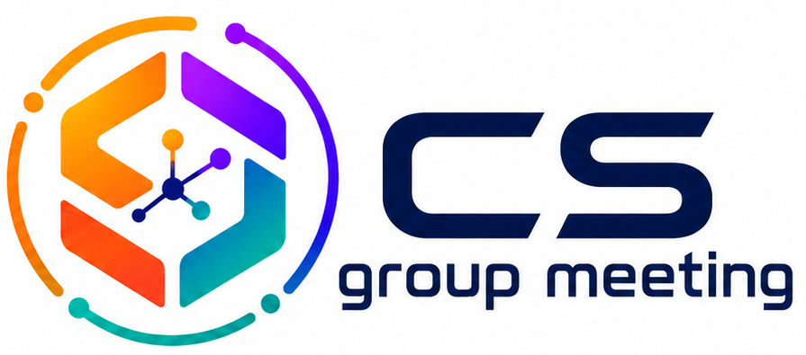

# cs-group-meeting-skill


<p align="center"><i>English version: <b><a href="README.en.md">README.en.md</a></b> ｜ 中文（当前）</i></p>

把一篇 CS 论文 PDF 变成一份中文组会汇报 PPT——按照实验室 `汇报模板.pptx` 的观感，
和 `汇报模板2.pptx` 的版式语汇。

产出的是**一条六段式的论证线**，不是图片集：
文献信息 → 研究背景 → 本文贡献 → 研究方法 → 实验结果 → 结论与不足。
每一页图都必须同时带要点框和结果分析——只有一张图配一句图注的页面，构建会直接报错。

日常用法不是手敲命令行，而是把论文丢给 agent：

> 把这篇论文做成组会 PPT


agent 会读全文、抽图、写 spec、构建、逐页渲染检查。命令行只是它内部调用的工具，
调试时也可以自己跑。

## 效果示例

以下是同一份真实产出的若干页 —— 输入是 *Adaptive Cross-Feature Fusion Network With
Inconsistency Guidance for Multi-Modal Brain Tumor Segmentation*（IEEE JBHI 2025）
的 PDF，输出共 23 页。

<table>
  <tr>
    <td width="50%"></td>
    <td width="50%"></td>
  </tr>
  <tr>
    <td><b>封面</b>：logo、二维码、汇报人、主页全是虚线占位框 —— 用户没提供身份信息时就长这样，不会悄悄用模板作者的。</td>
    <td><b>论文信息</b>：标题、作者、期刊卷期、DOI 从 PDF 里取。</td>
  </tr>
  <tr>
    <td></td>
    <td></td>
  </tr>
  <tr>
    <td><b>文献信息</b>（<code>info</code> 版式）：论文首页图 + 期刊/分区/被引信息表 + 一句话结论。绿色是关键术语，红色是核心指标。</td>
    <td><b>目录分隔页</b>：四条，不是六条 —— 目录讲的是论证的起承转合，不是章节索引。每进入一部分插一张，当前项高亮。</td>
  </tr>
  <tr>
    <td></td>
    <td></td>
  </tr>
  <tr>
    <td><b>研究背景</b>（<code>tree</code> 版式）：一句论断 → 箭头 → 三个并列分支，讲「现有方法各有什么短板」。这类页一张图都没有，靠结构本身说话。</td>
    <td><b>结论与不足</b>（<code>proscons</code> 版式）：创新点 / 局限性双色条，局限里连作者自己承认的推理速度、验证范围都点出来。</td>
  </tr>
</table>

## 在 agent 中使用

技能本体就是 `SKILL.md`（一份给 agent 读的操作说明）加 `scripts/` 下的三个 Python 脚本。
任何能读文件、能跑 Python 的 agent 都用得了，区别只在怎么让它自动加载。

### Claude Code

把整个目录放到技能目录下即可，无需注册：

- 个人全局：`~/.claude/skills/cs-group-meeting-skill/`（本仓库现在就在这）
- 仅某个项目：`<项目>/.claude/skills/cs-group-meeting-skill/`

`SKILL.md` 的 frontmatter 里 `name` 和 `description` 就是触发依据 —— 说到
「组会PPT」「文献汇报」「论文汇报」或给一篇论文 PDF，Claude Code 会自动加载；
也可以直接打 `/cs-group-meeting-skill` 显式调用。

### Codex

`agents/openai.yaml` 是给 Codex 这类运行时读的 manifest，声明了三件事：
显示名、一句话描述，以及默认 prompt —— 里面的 `$cs-group-meeting-skill`
就是 Codex 的技能调用语法：

```
$cs-group-meeting-skill 把这篇论文做成组会 PPT：paper.pdf
```

> Codex 的技能安装路径和加载方式各版本有出入，以你装的那版官方文档为准；
> 本仓库只保证 manifest 和 `SKILL.md` 的内容是对的。

### 其他 agent

没有技能机制的 agent，直接把 `SKILL.md` 全文塞进上下文当 system prompt / 指令，
再告诉它仓库路径和论文路径就能跑。它需要的只是文件读写和执行 Python 的能力。
`SKILL.md` 里的命令都写成了 `<skill-dir>\scripts\...` 的形式，替换成实际路径即可。

## 环境依赖

- Python 3.12+，装 `python-pptx`、`pdfplumber`、`Pillow`
- Poppler 的 `pdftoppm`（渲染 PDF 页面用；不在 PATH 里可以用 `--pdftoppm` 指定）
- PowerPoint（Windows COM）——只在最后渲染 PNG 自检时需要

## 快速上手

```powershell
# 1. 抽图：渲染每页 + 聚类矢量图元定位图片
& python scripts\extract_figures.py extract --pdf paper.pdf --workdir <scratch>

# 2. 看一遍 <scratch>\crops\ 里的每张裁剪图，错的按 PDF point 重裁
& python scripts\extract_figures.py recrop --workdir <scratch> --fig 9 --bbox 80 323 531 416

# 3. 写 <scratch>\deck.json（格式见 SKILL.md 的 Deck spec），然后构建
& python scripts\build_deck.py --spec <scratch>\deck.json `
    --template assets\汇报模板.pptx --out 组会汇报.pptx
```

N 页正文最终会变成 N + 4 + 3 页：四张目录分隔页，加封面 / 论文信息 / 谢谢大家。

## 目录结构

| 路径 | 作用 |
|---|---|
| `SKILL.md` | 技能本体：约束、工作流、deck spec、11 种页型、写作要求 |
| `scripts/extract_figures.py` | 抽图 / 重裁（`extract`、`recrop`、`crop` 三个子命令） |
| `scripts/build_deck.py` | 从 deck.json 构建 PPTX；含 `check_*` 系列构建期校验 |
| `scripts/omml.py` | `$latex$` → PowerPoint 原生公式（OMML） |
| `assets/汇报模板.pptx` | 观感来源，默认模板 |
| `assets/汇报模板2.pptx` | 版式语汇来源（图上红色标注、结果分析框） |
| `assets/content.pptx` | 目录分隔页的样式来源（`--content` 可覆盖） |
| `references/style-profile.md` | 从模板量出来的几何与配色，`build_deck.py` 已编码 |
| `agents/openai.yaml` | Codex 侧的 manifest：显示名、描述、默认 prompt |

细节都在 [SKILL.md](SKILL.md)。
